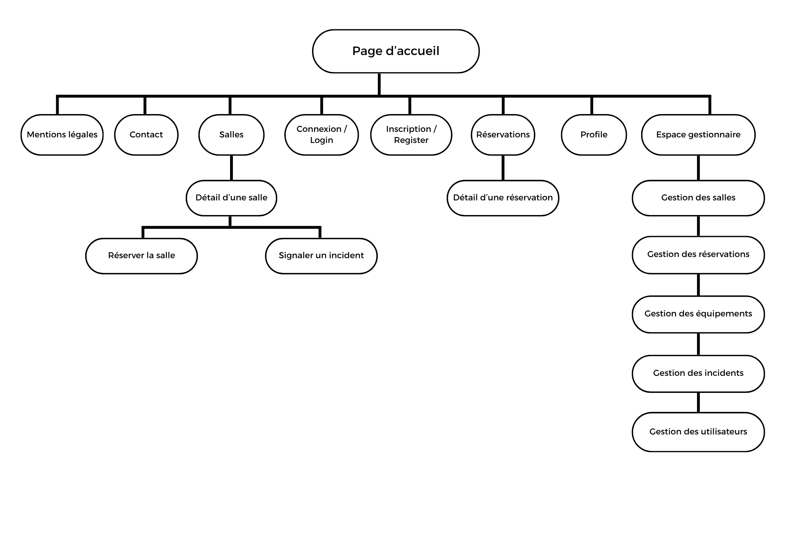

# Crénevo

> **Réservez simplement. Organisez intelligemment.**

## Présentation générale

- **Quoi ?** Développement d’une application web permettant de consulter les salles disponibles d’un établissement, de les réserver et de centraliser leur gestion.
- **Pourquoi ?** Les réservations réalisées par échanges oraux, e-mails ou tableaux partagés entraînent des doubles réservations, un manque de visibilité et une perte de temps.
- **Pour qui ?** Les membres autorisés d’un établissement (enseignants, intervenants, personnel administratif, associations internes) et les gestionnaires chargés des salles.
- **Comment ?** Une application web monolithique, responsive et sécurisée, développée avec Node.js, Express, EJS, PostgreSQL et Sequelize.
- **Quand ?** Le projet sera réalisé par itérations : conception, développement du MVP, tests, recette, correction et déploiement.

## Présentation du Projet de Développement

### Besoins Fonctionnels (Minimum Viable Product - MVP)

- Landing page présentant Crénevo et son fonctionnement.
- Système d’inscription, de connexion et de déconnexion sécurisées.
- Consultation et modification du profil de l’utilisateur.
- Consultation de la liste des salles actives.
- Recherche des salles disponibles selon une date, une heure de début, une heure de fin et un nombre de participants.
- Filtrage des salles par bâtiment, capacité et équipement.
- Consultation des informations détaillées d’une salle : localisation, capacité, description, équipements et mode de validation.
- Création d’une réservation pour une salle disponible.
- Détection automatique des conflits avec les réservations et les périodes d’indisponibilité existantes.
- Confirmation automatique d’une réservation pour une salle standard.
- Mise en attente d’une réservation lorsqu’une salle nécessite l’accord d’un gestionnaire.
- Consultation de l’historique et du statut de ses réservations.
- Annulation d’une réservation future par son propriétaire.
- Signalement d’un incident concernant une salle.
- Gestion des salles, des équipements, des indisponibilités et des comptes par un gestionnaire.
- Validation ou refus des demandes de réservation en attente par un gestionnaire.
- Consultation et traitement des incidents par un gestionnaire.

### Propositions d’évolutions possibles

- Envoi de notifications par e-mail lors de la création, de la validation, du refus ou de l’annulation d’une réservation.
- Export des réservations au format iCalendar (`.ics`).
- Synchronisation avec Google Calendar ou Outlook.
- Création de réservations récurrentes.
- Ajout de statistiques sur le taux d’occupation des salles.
- Ajout d’un QR code permettant de confirmer l’occupation d’une salle.
- Développement d’une application mobile.

Contraintes Techniques

- **Technologies :** application monolithique :  
  - Node.js et Express pour le serveur, 
  - EJS pour les vues, 
  - PostgreSQL pour la base de données, 
  - Sequelize comme ORM. 
- **Architecture :** organisation du projet selon une architecture MVC.
- **Conteneurisation :** utilisation de Docker et Docker Compose pour exécuter l’application Node.js et la base de données PostgreSQL dans des conteneurs séparés.
- **Tests unitaires :** utilisation de Jest pour tester les principales règles métier.
- **Intégration continue (CI) :** utilisation de GitHub Actions pour installer les dépendances et exécuter automatiquement les tests lors des push et des pull requests.
- **Sécurité :** authentification sécurisée, mots de passe hachés avec Argon2, contrôle des rôles et protection contre les failles courantes telles que les attaques XSS, CSRF et les injections SQL.
- **Validation :** contrôle et normalisation de toutes les données côté serveur.
- **Déploiement :** rédaction d’une procédure permettant de déployer l’application dans un environnement distinct du développement.
- **Responsive :** application développée en mobile first et adaptée aux ordinateurs, tablettes et téléphones.
- **Accessibilité :** respect des recommandations [WCAG](https://www.w3.org/WAI/standards-guidelines/wcag/) avec un objectif de niveau AA.
- **RGPD et mentions légales :** collecte limitée aux données nécessaires, information des utilisateurs et mise en place des pages légales obligatoires.
- **Versionnement :** utilisation de Git et GitHub avec les branches `main`, `develop` et `feature/*`.
- **SEO :** application des bonnes pratiques de référencement sur les pages publiques.
- **Navigateurs compatibles :** versions récentes de Chrome, Firefox, Edge et Safari.
- **Bonus :**
  - déploiement de l’application et de la base PostgreSQL ;
  - envoi d’e-mails ;
  - éco-conception avec optimisation des images et des ressources statiques.

  ### Routes

  #### L’arborescence des routes

  

  #### Détail des routes

| Méthode | Route | Description | Accès |
|---|---|---|---|
| GET | `/` | Page d’accueil et présentation de Crénevo | Public |
| GET | `/register` | Page d’inscription | Public |
| POST | `/register` | Soumission du formulaire d’inscription | Public |
| GET | `/login` | Page de connexion | Public |
| POST | `/login` | Soumission du formulaire de connexion | Public |
| POST | `/logout` | Déconnexion | Utilisateur connecté |
| GET | `/legal` | Mentions légales et politique de confidentialité | Public |
| GET | `/profile` | Consultation du profil | Utilisateur connecté |
| GET | `/profile/edit` | Formulaire de modification du profil | Utilisateur connecté |
| POST | `/profile/edit` | Modification du profil | Utilisateur connecté |
| GET | `/rooms` | Liste, recherche et filtrage des salles | Utilisateur connecté |
| GET | `/rooms/:id` | Détails d’une salle | Utilisateur connecté |
| GET | `/reservations` | Liste des réservations de l’utilisateur | Utilisateur connecté |
| GET | `/reservations/new` | Formulaire de réservation | Utilisateur connecté |
| POST | `/reservations` | Création d’une réservation | Utilisateur connecté |
| GET | `/reservations/:id` | Détails d’une réservation | Propriétaire ou gestionnaire |
| POST | `/reservations/:id/cancel` | Annulation d’une réservation future | Propriétaire ou gestionnaire |
| POST | `/rooms/:id/incidents` | Signalement d’un incident | Utilisateur connecté |
| GET | `/admin` | Tableau de bord de gestion | Gestionnaire |
| GET | `/admin/reservations` | Liste des demandes de réservation | Gestionnaire |
| POST | `/admin/reservations/:id/approve` | Validation d’une réservation en attente | Gestionnaire |
| POST | `/admin/reservations/:id/reject` | Refus d’une réservation en attente | Gestionnaire |
| GET | `/admin/rooms` | Liste des salles à administrer | Gestionnaire |
| GET | `/admin/rooms/new` | Formulaire de création d’une salle | Gestionnaire |
| POST | `/admin/rooms` | Création d’une salle | Gestionnaire |
| GET | `/admin/rooms/:id/edit` | Formulaire de modification d’une salle | Gestionnaire |
| POST | `/admin/rooms/:id/edit` | Modification d’une salle | Gestionnaire |
| POST | `/admin/rooms/:id/toggle` | Activation ou désactivation d’une salle | Gestionnaire |
| POST | `/admin/rooms/:id/unavailabilities` | Création d’une période d’indisponibilité | Gestionnaire |
| GET | `/admin/equipment` | Liste des équipements | Gestionnaire |
| POST | `/admin/equipment/create` | Création d’un équipement | Gestionnaire |
| POST | `/admin/equipment/:id/edit` | Modification d’un équipement | Gestionnaire |
| POST | `/admin/equipment/:id/toggle` | Activation ou désactivation d’un équipement | Gestionnaire |
| GET | `/admin/incidents` | Liste des incidents signalés | Gestionnaire |
| POST | `/admin/incidents/:id/status` | Modification du statut d’un incident | Gestionnaire |
| GET | `/admin/users` | Liste des comptes utilisateurs | Gestionnaire |
| POST | `/admin/users/:id/toggle` | Activation ou désactivation d’un compte | Gestionnaire |

#### User Stories

| Rôle | En tant que | Je veux pouvoir |
|---|---|---|
| Visiteur | En tant que visiteur, | je veux pouvoir consulter la présentation de Crénevo. |
| Visiteur | En tant que visiteur, | je veux pouvoir m’inscrire pour créer un compte. |
| Visiteur | En tant que visiteur, | je veux pouvoir me connecter à mon compte. |
| Utilisateur | En tant qu’utilisateur, | je veux pouvoir consulter et modifier mon profil. |
| Utilisateur | En tant qu’utilisateur, | je veux pouvoir rechercher les salles disponibles pour une période donnée. |
| Utilisateur | En tant qu’utilisateur, | je veux pouvoir filtrer les salles par capacité et équipement. |
| Utilisateur | En tant qu’utilisateur, | je veux pouvoir consulter les informations détaillées d’une salle. |
| Utilisateur | En tant qu’utilisateur, | je veux pouvoir réserver une salle disponible. |
| Utilisateur | En tant qu’utilisateur, | je veux être informé lorsqu’un créneau est déjà occupé ou indisponible. |
| Utilisateur | En tant qu’utilisateur, | je veux pouvoir consulter le statut et l’historique de mes réservations. |
| Utilisateur | En tant qu’utilisateur, | je veux pouvoir annuler l’une de mes réservations futures. |
| Utilisateur | En tant qu’utilisateur, | je veux pouvoir signaler un incident concernant une salle. |
| Utilisateur | En tant qu’utilisateur, | je veux pouvoir me déconnecter de mon compte. |
| Gestionnaire | En tant que gestionnaire, | je veux pouvoir créer et modifier les salles. |
| Gestionnaire | En tant que gestionnaire, | je veux pouvoir activer ou désactiver une salle sans supprimer son historique. |
| Gestionnaire | En tant que gestionnaire, | je veux pouvoir gérer les équipements associés aux salles. |
| Gestionnaire | En tant que gestionnaire, | je veux pouvoir déclarer une période d’indisponibilité. |
| Gestionnaire | En tant que gestionnaire, | je veux pouvoir accepter ou refuser une réservation en attente. |
| Gestionnaire | En tant que gestionnaire, | je veux pouvoir consulter et traiter les incidents signalés. |
| Gestionnaire | En tant que gestionnaire, | je veux pouvoir activer ou désactiver un compte utilisateur. |

#### Organisation du projet

Crénevo est un projet individuel réalisé par Zakaria (Moi), qui assure la conception fonctionnelle et technique, le développement full-stack, la gestion de la base de données, les tests, le versionnement et le déploiement de l’application.

#### Organisation du travail

Mise en place d’un tableau Kanban composé des colonnes `Backlog`, `À faire`, `En cours`, `En revue` et `Terminé`. Chaque fonctionnalité sera développée sur une branche `feature/*`, puis fusionnée dans `develop` après vérification. La branche `main` contiendra uniquement les versions stables et présentables du projet.