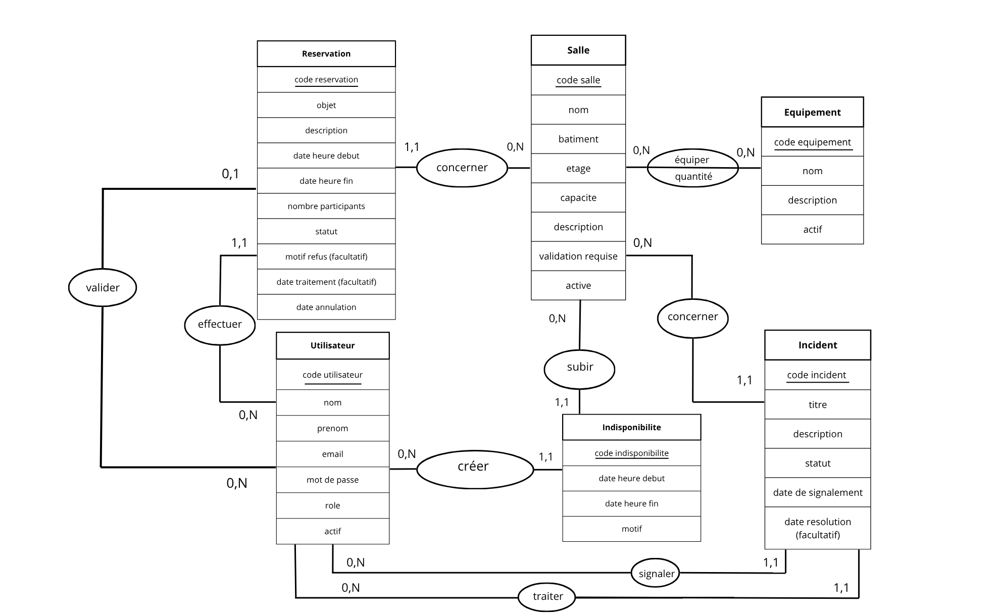

# MCD (Modèle Conceptuel de Données)

# MLD (Modèle Logique de Données)

USER (id, last_name, first_name, email, password_hash, role, active) 
ROOM (id, name, building, floor, capacity, description, approval_required, active) 
RESERVATION (id, subject, description, start_at, end_at, participant_count, status, rejection_reason, processed_at, canceled_at, #user_id, #room_id, #manager_id) 
EQUIPMENT (id, name, description, active) 
ROOM_EQUIPMENT (#room_id, #equipment_id, quantity) 
UNAVAILABILITY (id, start_at, end_at, reason, #room_id, #manager_id) 
INCIDENT (id, title, description, status, reported_at, resolved_at, #room_id, #reported_by_id, #manager_id) 

